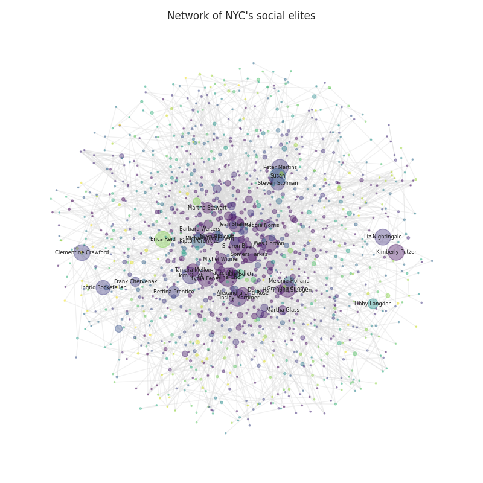
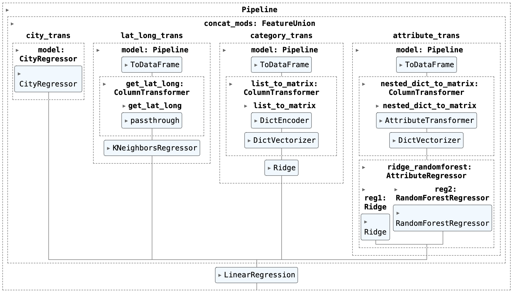

Recently, I completed the intensive 8-week Data Science Fellowship at The Data Incubator (TDI), during which I worked on the following weekly projects:
## 1. Who are the most well-connected individuals?
- **What I did:**
  - Parsed photo captions from New York Social Diary and constructed network of NYC's social elites, to identify most well-connected individuals and frequent pairs
- **Data:** 1K+ captions from [newyorksocialdiary.com](https://www.newyorksocialdiary.com/)
- **Main packages:** request, spacy, networkx
<p align="center">

</p>

## 2. Can I predict star ratings of businesses?
- **What I did:**
  - Fine-tuned boosting and bagging ensemble models to predict star-ratings of businesses, utilizing KNeighborsRegressor, Ridge, RandomForestRegressor, and custom regressors
- **Data:** 37K+ businesses from [Yelp open dataset](https://www.yelp.com/dataset)
- **Main packages:** scikit-learn, pandas, numpy
<p align="center">

</p>

## 3. Which violations are more common for which cuisines?
- **What I did:** Analyzed data in SQL with CTEs to aggregate most recent restaurant inspections per zipcode/borough and normalize conditional probabilities of specific violations per cuisine
- **Data:** 531K+ observations from [NYC open data](https://data.cityofnewyork.us/Health/DOHMH-New-York-City-Restaurant-Inspection-Results/43nn-pn8j/about_data)
- **Main packages:** sql
```math
Normalized\ conditional\ probability = {P(Specific\ violation\ |\ Specific\ cuisine) \over P(Specific\ violation\ |\ All\ cuisines)}
```

## 4. With NLP, can I predict star ratings of businesses?
- **What I did:**
 - Predicted star ratings of businesses from review texts by fine-tuning word vectorizers and SGDRegressor, increased R<sup>2</sup> (coefficient of determination) from 0.53 to 0.58
 - Analyzed word polarity (indicating 1- or 5-star reviews) using TfidfVectorizer and MultinomialNB
- **Data:** 253K+ reviews from [Yelp open dataset](https://www.yelp.com/dataset)
- **Main packages:** scikit-learn, pandas, numpy
<p align="center">

</p>

## 5. How to model temperature over time?
- **What I did:**
  - Modeled time series of temperature grouped by 5 cities using custom Fourier transformer and LinearRegression
- **Data:** 392K+ observations
- **Main packages:** scikit-learn, pandas, numpy
<p align="center">

</p>

## 6. Can I "profile" users?
- **What I did:**
  - Leveraged distributed computing to wrangle 10GB of Stack Exchange posts and users, in order to identify users' activity preference and active duration
- **Data:** 24M+ posts & 4M+ users from [stackexchange.com](https://archive.org/details/stackexchange)
- **Main packages:** spark rdd, spark dataframe

## 7. With NLP, is your post going to be popular?
- **What I did:**
  - Fine-tuned HashingTF and LogisticRegression to predict if given post contains most popular tags based on post content
- **Data:** 24M+ posts & 4M+ users from [stackexchange.com](https://archive.org/details/stackexchange)
- **Main packages:** spark ml

## 8. How to improve neural networks for image classification?
- **What I did:**
  - Built CNN and transfer learning model ([inception](https://github.com/tensorflow/tpu/tree/906be5267106a72d51d682d6fda15210118840cf/models/experimental/inception) deep learning + dense neural network), improved image classification accuracy from 71% to 84%
- **Data:** 60K images from [CIFAR-10 dataset](https://www.cs.toronto.edu/~kriz/cifar.html)
- **Main packages:** tensorflow, keras, scikit-learn
<p align="center">

</p>
